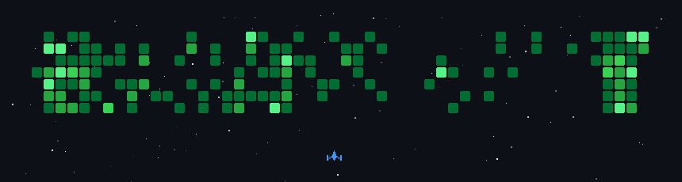

  <a href="https://x.com/aru_codes">X</a> •
  <a href="https://www.linkedin.com/in/anurup-bhowmick/">LinkedIn</a> •
  <a href="https://medium.com/@anurupbhowmick">Medium</a>

<!-- =========================
     TECH STACK
========================= -->

<h2 align="left">Tech Stack</h2>

### Languages

  

### Frontend

  

### Backend

  

### Databases

  

### AI / ML

  

### DevOps & Tools

  

### Design & Editing

